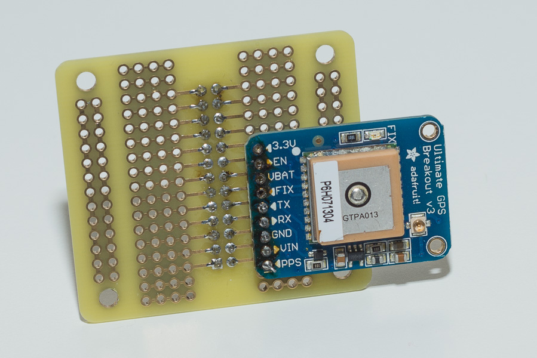
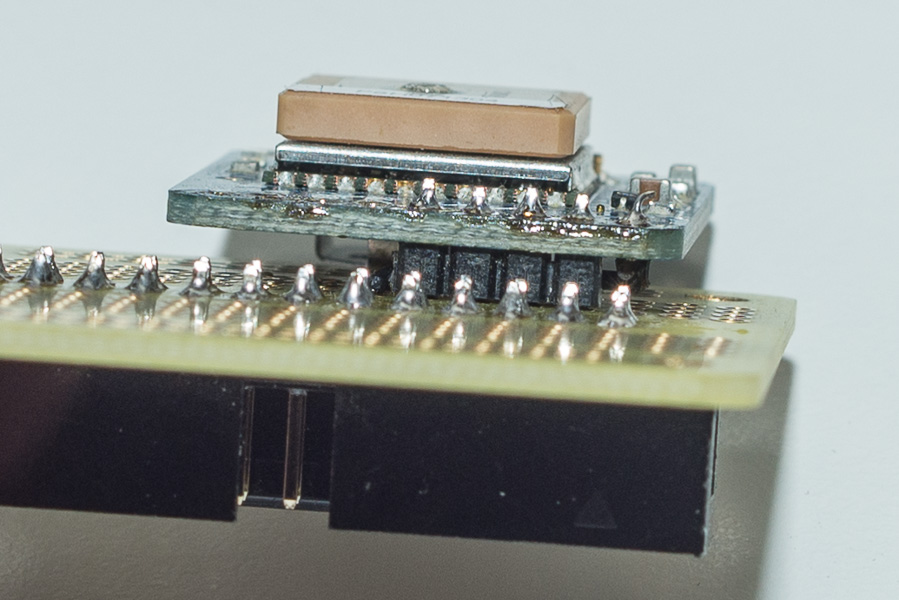

Raspberry Pi NTP Server
===
I've been running a couple GPS-based Raspberry Pi NTP servers for a while. Here are the steps I follow to set up a new one.

Credit
---
The following pages helped witht his process

* [David Taylor](http://www.satsignal.eu/davids.html) has a [Raspberry Pi NTP page](http://www.satsignal.eu/ntp/Raspberry-Pi-NTP.html) that the definitive source.
* Running PPS without a kernel hack is possible due to [rpi_gpio_ntp](https://www.vanheusden.com/time/rpi_gpio_ntp/) by [Folkert van Heusden](https://www.vanheusden.com).

I'm using Jessie Lite (*2015-11-21-raspbian-jessie-lite.img*) as I document this.

Hardware Requirements
---
I'm using the following hardware:

* Raspberry Pi B
* [Adafruit Small-Size Perma-Proto Raspberry Pi Breadboard PCB Kit](https://www.adafruit.com/products/1171)
* [Adafruit Ultimate GPS Breakout](https://www.adafruit.com/products/746)
 
In order to simplify construction I soldered four pins of the GPS board to the perma-proto board. In order to get the PPS to pin 18 on the Raspberry Pi I snuck a wire in underneath that you can sort-of see in the edge-on picture.

 
Initial Setup
---
I follow [my own guide](InitialConfiguration.md) for the initial setup but note the following change and detail:

* On raspi-config step 9, I use the "Serial" option to disable the serial console.
* If you use dhcp, ensure you perform the last step on that page to stop the dhcp server from overwriting your ntp configuration file.

Configuration as NTP server
---
According to David Taylor's [user-mode configuration](http://www.satsignal.eu/ntp/Raspberry-Pi-NTP.html#user-mode) instructions, we've already achieved the top 5 bullet points! Next we'll set up GPSD.

### gpsd setup

1. Install gpsd: `sudo apt-get install gpsd gpsd-clients`
2. Edit `/etc/default/gpsd` as root to set things up:
   * Change the DEVICES line to read: `DEVICES="/dev/ttyAMA0"`
   * Change the GPSD_OPTIONS line to read `GPSD_OPTIONS="-n"`
3. Restart gpsd `sudo service gpsd restart`
4. Verify gps stuff is working: `cgps -s` - we're mostly looking for `Status: 3D FIX`.
5. `q` to exit cgps.
6. Due to what seems to be a systemd configuration problem, we have to [tell Raspbian to start gpsd on boot](https://lists.debian.org/debian-user/2015/10/msg01281.html). Edit `/lib/systemd/system/gpsd.service` and find the `[Install]` section and insert a line between that section header and the `Also=gpsd.socket` line:

        [Install]
        WantedBy=multi-user.target
        Also=gpsd.socket
       
    Then run `sudo systemctl enable gpsd.service`.

7. If you want, do a `sudo reboot` to restart and then log in and run `ps auxw |grep gpsd` to ensure gpsd is starting on boot and `cgps -s` again to make sure everything continues to work.

### Get ntpd talking to the gps

1. Edit `/etc/ntpd.conf` and add this section so we can figure out an appropriate fudge value to use for your configuration:
   
        # Server to be monitored only, not selected for syncing
        server 127.127.28.0 minpoll 4 maxpoll 4 noselect
        fudge 127.127.28.0 time1 0.000 refid GPSD

   You can add a couple other servers if you'd like (or leave some pool servers enabled), as well. Restart ntpd with `sudo service ntp restart`.

2. Wait a bit. You should see when you run `ntpq -p` that it's getting good updates (there'll be an offset and your reach column will ultimately read 377).

3. Once you see a reach value of 377, start running ntpq -p every minute or two and check out the offset column. You'll want to come up with an average of these numbers.

4. Edit your `/etc/ntpd.conf` and update the value after time1 to be the average number you got from the offset column multiplied by -0.001 (e.g. if your average value was -477 you'll enter 0.477 as your fudge value. You can also remove the noselect so that ntpd will start using this time source when we restart it next.

### Get PPS coming from the gps

1. Download the latest rpi_gpio_ntp software from [www.vanheusden.com](https://www.vanheusden.com/time/rpi_gpio_ntp/) - currently that's version 1.5 (`curl -O https://www.vanheusden.com/time/rpi_gpio_ntp/rpi_gpio_ntp-1.5.tgz`).

2. Decompress it (`tar -zxvf rpi_gpio_ntp-1.5.tgz`). Change into the directory (`cd rpi_gpio_ntp-1.5`).

3. Build the software and install it to `/usr/local/bin/` with `sudo make install`.

4. Verify PPS operation with `sudo /usr/local/bin/rpi_gpio_ntp -g 18 -d` - this command assumes GPIO pin 18 (see the Hardware Requirements above).

5. You should see some interrupts coming in. If so, hit Control-C to get out of this software.

6. Edit `/etc/rc.local` and add the following line before `exit 0` at the bottom of the file:

        /usr/local/bin/rpi_gpio_ntp -N 1 -g 18

7. Edit your `/etc/ntp.conf` again to add the PPS source:

        server 127.127.28.1 minpoll 4 prefer
        fudge 127.127.28.1 refid UPPS

8. `sudo reboot` to make sure everything comes up properly on boot.

9. Use `ntpq -p` to see if you are getting time updates and how they compare to other servers.
